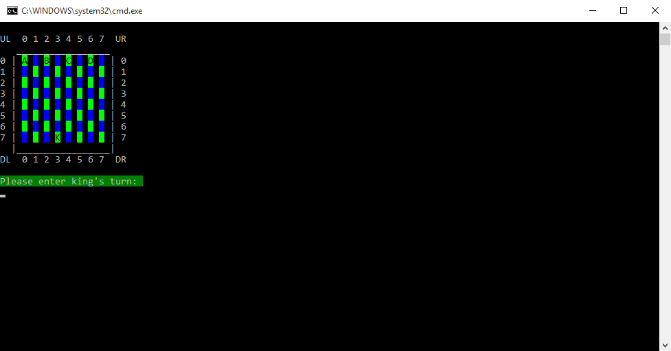

# KING SURVIVAL
A turn-based console game project for Telerik Software Academy.

## Description:
  The player takes control of the King. The objective is to reach the other side of the board. But there are 4 Pawns
  in his way. So he has to avoid being cornered by them. 

## Rules
- King can move diagonally in the following directions:
<h1>
↖↗  
↙↘  
</h1>

- Pawns can move diagonally in the following directions:
<h1>↙↘</h1>
- Neither of the figures can take another figure.

✔ Player wins when the King reaches the end of the board.

✖ Player loses when the Pawns block the King's way so that he can't move.

## Screenshots:

